# Geoscale — מסמך אפיון עיצובי מלא לאינה

**תאריך:** 25.03.2026
**פרויקט:** עיצוב מחדש של מוצר Geoscale
**קישור לדמו:** https://geoscale-demo-design.vercel.app
**קוד מקור:** https://github.com/s0RRy12341/geoscale-demo-design

---

## מבוא

המסמך הזה מתאר את כל המסכים ב-Demo Design של Geoscale — פלטפורמה לניטור נוכחות מותגים במנועי AI (ChatGPT, Gemini).
הדמו בנוי ב-Next.js כ-clickable prototype עם דאטה סטטי. כל מה שמוצג כאן הוא **כיוון עיצובי** ולא מוצר סופי.

**חשוב:** כל העיצוב הוא RTL (עברית, ימין-לשמאל). הטקסטים בעברית, הכיוון הוא `dir="rtl"`.

**כל סקשיין מלווה בצילום מסך מתוך הדמו החי.**

---

## 1. שפה עיצובית (Design Language)

### צבעים — צבעי המותג המדויקים

| שם | קוד HEX | שימוש |
|---|---|---|
| **שחור** | `#000000` | כותרות ראשיות, טקסט ראשי |
| **שחור-כמעט** | `#141414` | לוגו wordmark, רקע כהה |
| **לבן** | `#FFFFFF` | רקע ראשי, כרטיסים |
| **רקע חלופי** | `#F9F9F9` | רקע משני (expanded rows, hover) |
| **טורקיז (Teal)** | `#10A37F` | **צבע המותג היחיד** — אינדיקטורים חיוביים, כפתורי CTA, אחוזים גבוהים |
| **בורדר** | `#BFBFBF` | גבול כרטיסים, קווים מפרידים |
| **בורדר דק** | `#DDDDDD` | גבולות משניים, בדג'ים |
| **טקסט גוף** | `#333333` | טקסט תוכן רגיל |
| **טקסט מעומעם** | `#727272` | טקסט משני, תיאורים |
| **טקסט בהיר** | `#777777` | טקסט עזר |
| **אייקונים אפורים** | `#A2A9B0` | אייקונים, מספרי שורות |
| **טבעת לוגו** | `#ABABAB` | הטבעת האפורה של הלוגו |
| **כחול Gemini** | `#4285F4` | רק לאייקון Google Gemini |

### כללים חשובים:
- **אין גרדיאנטים** — בכלל
- **אין צלליות (box-shadow)** — בכלל
- **צבע אחד בלבד** מלבד שחור/לבן/אפור: `#10A37F` (טורקיז)
- הכל שטוח (flat), מינימלי, נקי

### טיפוגרפיה

| פונט | שימוש |
|---|---|
| **Inter** | UI ראשי — כפתורים, ניווט, מספרים, תוויות |
| **Heebo** | טקסט עברי — כותרות, תוכן, תיאורים |

**גדלים חשובים:**
- כותרת עמוד: 26px, fontWeight 700
- כותרת סקשיין: 15-18px, fontWeight 600
- טקסט גוף: 14px, fontWeight 400
- טקסט קטן / בדג'ים: 12-13px
- מספרים גדולים (מטריקות): 36-40px, fontWeight 700

### מרכיבים בסיסיים

| מרכיב | מפרט |
|---|---|
| **כרטיס (Card)** | `border: 1px solid #BFBFBF`, `border-radius: 10px`, `background: #FFFFFF` |
| **כפתור ראשי** | `background: #000000`, `color: #FFFFFF`, `border-radius: 9px`, `font-size: 13px`, `font-weight: 600` |
| **כפתור משני** | `background: transparent`, `border: 1px solid #BFBFBF`, `border-radius: 9px` |
| **בדג' (Badge)** | `border: 1px solid #DDDDDD`, `border-radius: 10px`, `padding: 2px 8px`, `font-size: 12px` |
| **בדג' "מוזכר"** | `border: 1px solid #10A37F`, `color: #10A37F` + אייקון V |
| **בדג' "לא מוזכר"** | `border: 1px solid #DDDDDD`, `color: #727272` + אייקון X |
| **Progress Ring** | עיגול SVG, `stroke: #10A37F` על רקע `#F9F9F9` |

---

## 2. הדר (Header) — אחיד בכל הדפים

> **ראי צילום מסך:** בכל צילום מסך של הדפים — ההדר נמצא בחלק העליון. שימי לב ליישור 3 העמודות.

**מבנה:** CSS Grid עם 3 עמודות: `1fr auto 1fr`

```
┌─────────────────────────────────────────────────────┐
│  [סריקה חדשה + מחובר]    [דשבורד | סריקות]    [לוגו Geoscale] │
│  justifySelf: start         auto-center       justifySelf: end  │
└─────────────────────────────────────────────────────┘
```

- **גובה:** 72px
- **רוחב מקסימלי:** 1300px, ממורכז
- **פדינג:** `0 24px`
- **רקע:** `rgba(255,255,255,0.96)` (שקוף מעט)
- **בורדר תחתון:** `1px solid #BFBFBF`
- **Position:** sticky, top: 0
- **ניווט:** 2 לשוניות בלבד — **דשבורד** | **סריקות** (אין "מוצרים / שירותים" בניווט!)
- **לוגו:** בצד שמאל ויזואלית (בRTL = justifySelf: end)

---

## 3. פוטר (Footer) — אחיד בכל הדפים

> **ראי צילום מסך:** בתחתית כל צילום full-page. שימי לב לשלושת האזורים.

- **בורדר עליון:** `1px solid #BFBFBF`
- **רוחב מקסימלי:** 1300px
- צד ימין: לוגו מעגלי + תיאור "מונע על ידי AI מתקדם..."
- מרכז: 4 קישורים — "פידבק" | "דיווח באג" | "הצעות לשיפור" | "שימוש API"
- צד שמאל: `© GeoScale 2026`

---

## 4. דף 1: דשבורד ראשי ( / )

### צילום מסך — דשבורד מלא:
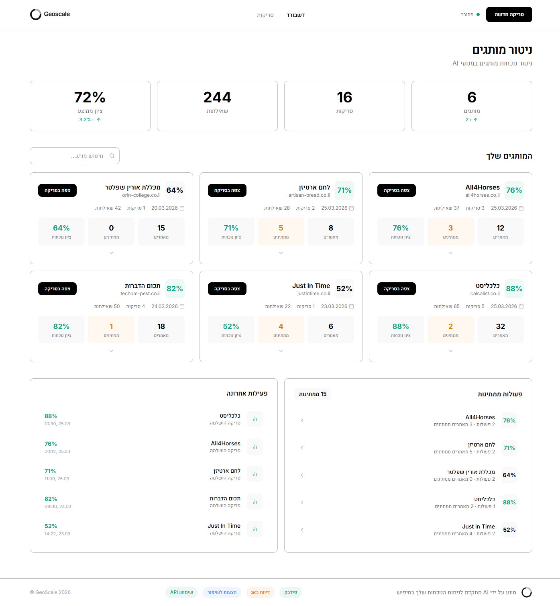

### צילום מסך — חלק עליון (הדר + מטריקות + כרטיסים):
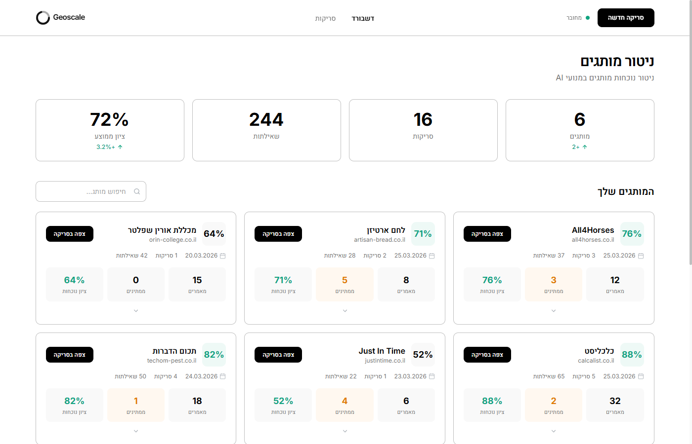

### 4.1 כותרת + מטריקות ראשיות
- כותרת: **"ניטור מותגים"** — fontSize: 26px, fontWeight: 700
- תת-כותרת: "ניטור נוכחות מותגים במנועי AI" — fontSize: 14px, color: #727272
- **4 כרטיסי מטריקה** בשורה אחת (מספרים גדולים):
  - מותגים: **6** (+ אייקון +2)
  - סריקות: **16**
  - שאילתות: **244**
  - ציון ממוצע: **72%** (+ אינדיקטור +3.2%)

### 4.2 כרטיסי מותגים
כותרת: **"המותגים שלך"** + שדה חיפוש

כל מותג הוא כרטיס שמציג:
- **שם המותג** + דומיין + ציון ב-Progress Ring
- כפתור **"צפה בסריקה"** (שחור)
- תאריך סריקה + מספר סריקות + מספר שאילתות
- **3 מטריקות קטנות:** מאמרים | ממתינים | ציון נוכחות
- **פעולות נדרשות** — רשימת action items (קישורים בטורקיז)
- **שאילתה מובילה** — ציטוט בגרשיים

6 מותגי דוגמה: All4Horses, לחם ארטיזן, מכללת אורין שפלטר, כלכליסט, Just In Time, תכום הדברות

### 4.3 פאנל תחתון — שני כרטיסים זה לצד זה
- **"פעולות ממתינות"** (15 ממתינות) — רשימת מותגים עם ציון + סיכום פעולות
- **"פעילות אחרונה"** — רשימת סריקות שהושלמו עם תאריך + ציון

---

## 5. דף 2: תוצאות סריקה ( /scan )

### צילום מסך — סקירה (Overview) מלאה:
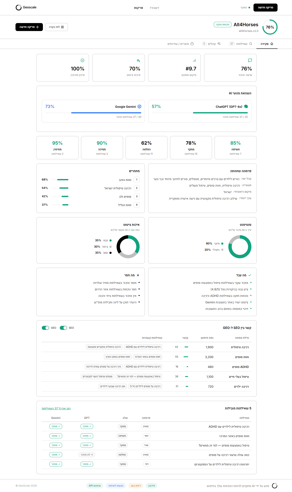

### צילום מסך — חלק עליון (הדר + מותג + לשוניות + מטריקות):
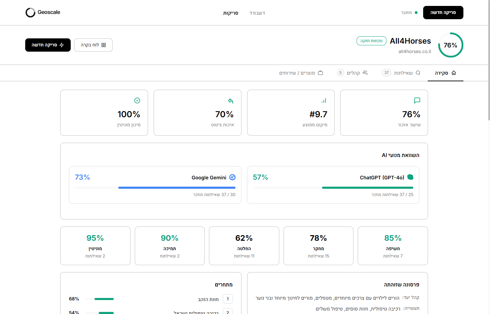

### 5.1 כותרת מותג (Brand Header)
- **Progress Ring** גדול עם ציון (76%)
- שם מותג: **All4Horses** — fontSize: 26px, fontWeight: 700
- דומיין: all4horses.co.il
- בדג' **"נוכחות חזקה"** (בורדר טורקיז)
- כפתורים: **"לוח בקרה"** (משני) + **"סריקה חדשה"** (שחור)

### 5.2 ארבע לשוניות (Tabs)
```
[סקירה] [שאילתות 37] [קהלים 5] [מוצרים / שירותים]
```
- לשונייה פעילה: `borderBottom: 2px solid #000000`
- **"מוצרים / שירותים" היא לשונייה רביעית — לא בתפריט העליון!**
- כל לשונייה עם אייקון + מספר (badge)

---

### TAB 1: סקירה (Overview)

> **ראי צילום מסך:** `02-scan-overview-full.png` — כל הסקשיינים מלמעלה למטה

#### 5.3 שורת מטריקות — 4 כרטיסים
| מטריקה | דוגמה | אייקון |
|---|---|---|
| שיעור אזכור | 76% | בועת דיבור |
| מיקום ממוצע | #9.7 | גרף עמודות |
| איכות ציטוט | 70% | ציטוט |
| סיכון מוניטין | 100% | מגן V |

#### 5.4 השוואת מנועי AI — שני כרטיסים זה לצד זה
- **ChatGPT (GPT-4o):** 57% — progress bar טורקיז — "25 / 37 שאילתות מוזכר"
- **Google Gemini:** 73% — progress bar כחול `#4285F4` — "30 / 37 שאילתות מוזכר"
- **אין** stacked bars, **אין** bar charts — רק שני כרטיסים נקיים!

#### 5.5 שלבי מסע לקוח — כרטיסים קומפקטיים
> **שינוי מהמקור:** אלכסיי ביקש להחליף progress bars אופקיים (תפסו מלא מקום) לפורמט קומפקטי

5 כרטיסים בשורה אופקית (grid 5 עמודות):
- **חשיפה** 85% (7 שאילתות) — טורקיז כי >= 80%
- **מחקר** 78% (15 שאילתות) — שחור
- **החלטה** 62% (11 שאילתות) — שחור
- **תמיכה** 90% (2 שאילתות) — טורקיז
- **מוניטין** 95% (2 שאילתות) — טורקיז

#### 5.6 פרסונה שזוהתה + מתחרים — שני כרטיסים זה לצד זה
- **פרסונה:** קהל יעד, תעשייה, מיקום גיאוגרפי, ערך ייחודי
- **מתחרים:** 4 מתחרים עם מספר + progress bar + אחוז

#### 5.7 סנטימנט + איכות ציטוט — שני כרטיסים עם Donut Charts
- **סנטימנט:** חיובי 80% / ניטרלי 20% (Donut chart)
- **איכות ציטוט:** גבוה 35% / בינוני 30% / נמוך 35% (Donut chart)

#### 5.8 מה עבד + מה חסר — שני כרטיסים זה לצד זה
- **"מה עבד"** (V ירוק): 5 bullet points חיוביים
- **"מה חסר"** (X אפור): 4 bullet points שליליים

#### 5.9 קשר בין SEO ל-GEO
- Toggle buttons: SEO / GEO
- טבלה: מילת מפתח | נפח חיפוש | קושי (progress bar) | שאילתות קשורות (badges)

#### 5.10 Top 5 שאילתות מובילות
- טבלה מינימלית: שאילתה | פרסונה (badge) | שלב (badge) | GPT (V/X) | Gemini (V/X)
- כפתור "הצג את כל 37 השאילתות"

---

### TAB 2: שאילתות (Queries)

### צילום מסך — טבלת שאילתות:
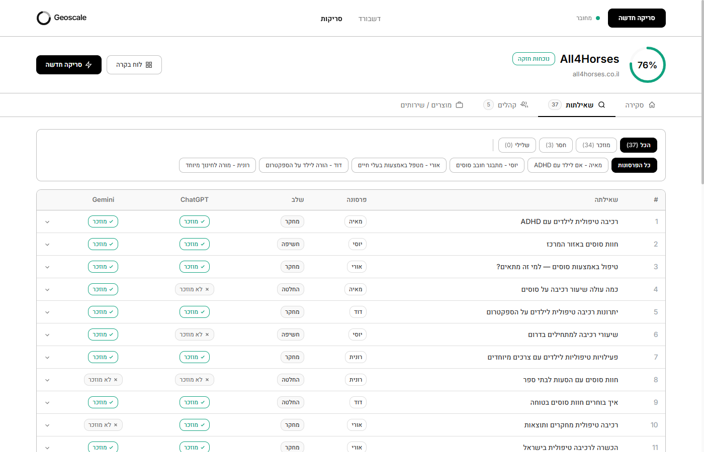

### צילום מסך — שאילתה פתוחה עם snippet + כפתור "הצג תשובה מלאה":
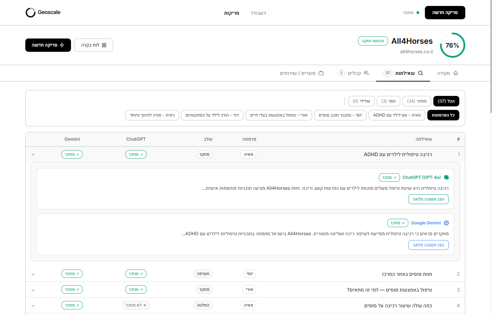

### צילום מסך — תשובה מלאה מ-ChatGPT (אחרי לחיצה על "הצג תשובה מלאה"):
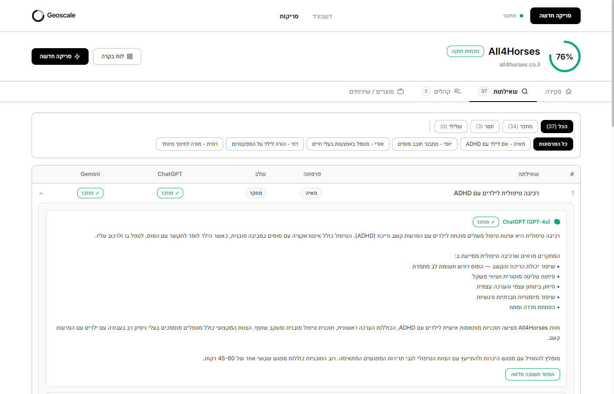

#### 5.11 פילטרים
- **סטטוס:** הכל (37) | מוזכר (34) | חסר (3) | שלילי (0)
- **פרסונה:** כפתורי בחירה — כל הפרסונות | מאיה | יוסי | אורי | דוד | רונית

#### 5.12 טבלת שאילתות
- עמודות: # | שאילתה | פרסונה (badge) | שלב (badge) | ChatGPT (V/X) | Gemini (V/X) | חץ
- **לחיצה על שורה** → נפתח panel מתחתיה עם רקע `#F9F9F9`

#### 5.13 Panel פתוח — תשובות מנועים
בתוך ה-panel שני כרטיסים:
- **ChatGPT (GPT-4o):** אייקון ירוק + badge "מוזכר"/"לא מוזכר" + snippet מקוצר
- **Google Gemini:** אייקון כחול + badge + snippet

**כפתור "הצג תשובה מלאה"** — לוחצים → הsnippet מתחלף לתשובה המלאה (טקסט ארוך עם bullet points).
**כפתור "הסתר תשובה מלאה"** — חוזר לsnippet.

- כפתור GPT: בורדר `#10A37F`, טקסט `#10A37F`
- כפתור Gemini: בורדר `#4285F4`, טקסט `#4285F4`

#### 5.14 שורת סיכום תחתונה
- "מציג X מתוך Y שאילתות"
- ספירות: מוזכר: X | חסר: X | שלילי: 0

---

### TAB 3: קהלים (Audiences)

### צילום מסך:
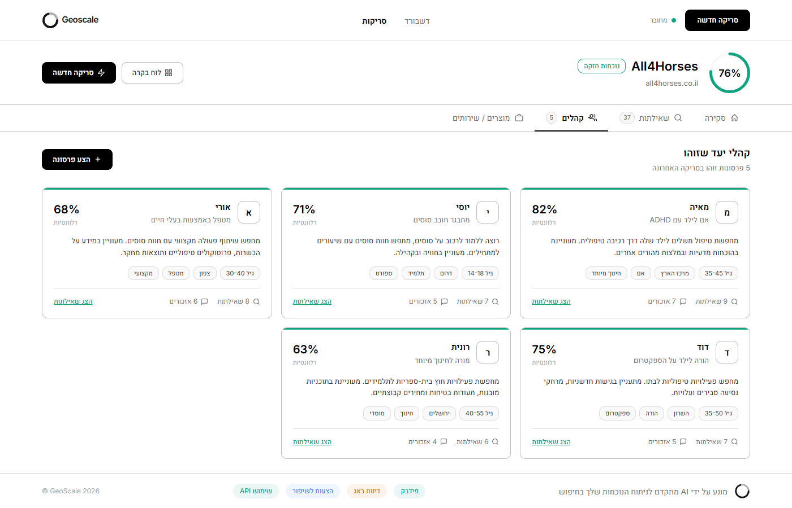

#### 5.15 כותרת
- **"קהלי יעד שזוהו"** + "5 פרסונות זוהו בסריקה האחרונה"
- כפתור **"+ הצע פרסונה"** (שחור)

#### 5.16 כרטיסי פרסונות (grid 3 עמודות)
כל כרטיס:
- אות ראשונה של השם (עיגול מלא בצבע)
- **שם** (כותרת) + **תפקיד**
- **אחוז רלוונטיות** (גדול, בצד שמאל)
- **תיאור** (פסקה)
- **תגיות** (badges): גיל, מיקום, תחום, סוג
- שורת נתונים: X שאילתות | X אזכורים
- כפתור **"הצג שאילתות"** (טורקיז)

5 פרסונות: מאיה (82%), יוסי (71%), אורי (68%), דוד (75%), רונית (63%)

**בורדר עליון של כרטיס:** `3px solid #10A37F` (ירוק — רק בצד עליון)

---

### TAB 4: מוצרים / שירותים (Products)

### צילום מסך:
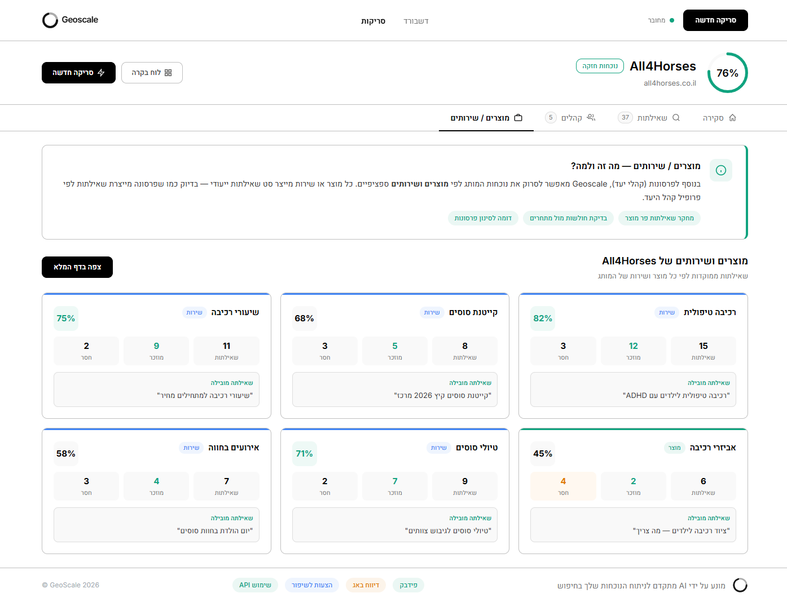

#### 5.17 באנר הסבר
- כרטיס עם אייקון info
- כותרת: **"מוצרים / שירותים — מה זה ולמה?"**
- הסבר: "בנוסף לפרסונות, Geoscale מאפשר לסרוק לפי **מוצרים ושירותים** ספציפיים"
- 3 badges: "מחקר שאילתות פר מוצר" | "בדיקת חולשות מול מתחרים" | "דומה לסינון פרסונות"

#### 5.18 כרטיסי מוצרים/שירותים (grid 3 עמודות)
כותרת: **"מוצרים ושירותים של All4Horses"** + כפתור **"צפה בדף המלא"**

6 כרטיסים:
- **רכיבה טיפולית** (שירות) — 82%, 15 שאילתות, 12 מוזכר, 3 חסר
- **קייטנת סוסים** (שירות) — 68%
- **שיעורי רכיבה** (שירות) — 75%
- **אביזרי רכיבה** (מוצר) — 45%
- **טיולי סוסים** (שירות) — 71%
- **אירועים בחווה** (שירות) — 58%

כל כרטיס: שם + סוג (badge) + ציון + 3 מטריקות + שאילתה מובילה

**חשוב:** הטאב הזה מופיע בתוך דף `/scan` — לא בניווט הראשי! כל מותג יש לו את המוצרים שלו.

---

## 6. דף 3: סריקה חדשה ( /new-scan )

תהליך 4 מסכים. כפתורי מעבר (1-4) בפינה שמאלית תחתונה.

### מסך 1: הזנת פרטי מותג

### צילום מסך:
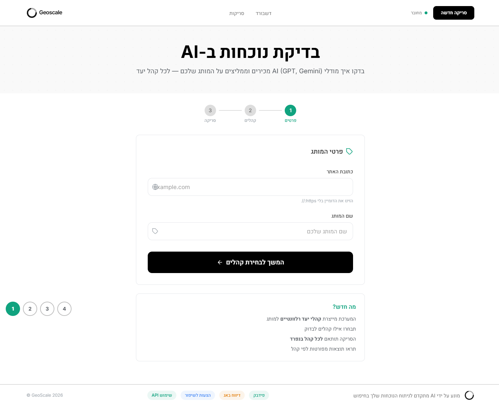

- **הדר** (אותו הדר כמו כל הדפים)
- **כותרת באנר ירוק:** "בדיקת נוכחות ב-AI" + תת-כותרת
- **Step indicator:** 3 שלבים — 1.פרטים (פעיל) → 2.קהלים → 3.סריקה
- **כרטיס טופס "פרטי המותג":**
  - שדה "כתובת האתר" (input עם אייקון גלובוס)
  - שדה "שם המותג" (input עם אייקון תגית)
  - כפתור **"המשך לבחירת קהלים"** (שחור, רוחב מלא, עם חץ)
- **כרטיס "מה חדש?"** — 4 bullet points על הפיצ'ר
- **פוטר**

### מסך 2: אנימציית ניתוח

### צילום מסך:
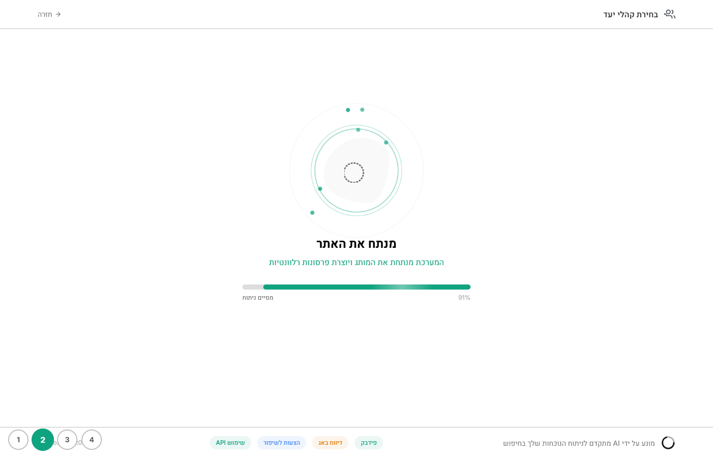

- **הדר מותאם:** "בחירת קהלי יעד" + כפתור "חזרה"
- **אנימציית לוגו** מסתובב במרכז עם pulse rings
- **כותרת:** "מנתח את האתר.."
- **תת-כותרת:** "המערכת מנתחת את המותג ויוצרת פרסונות רלוונטיות"
- **Progress bar** עם shimmer — אחוז + טקסט סטטוס ("מתחבר לאתר" → "מסיים ניתוח")
- **פוטר**

### מסך 3: בחירת פרסונות/קהלי יעד

### צילום מסך:
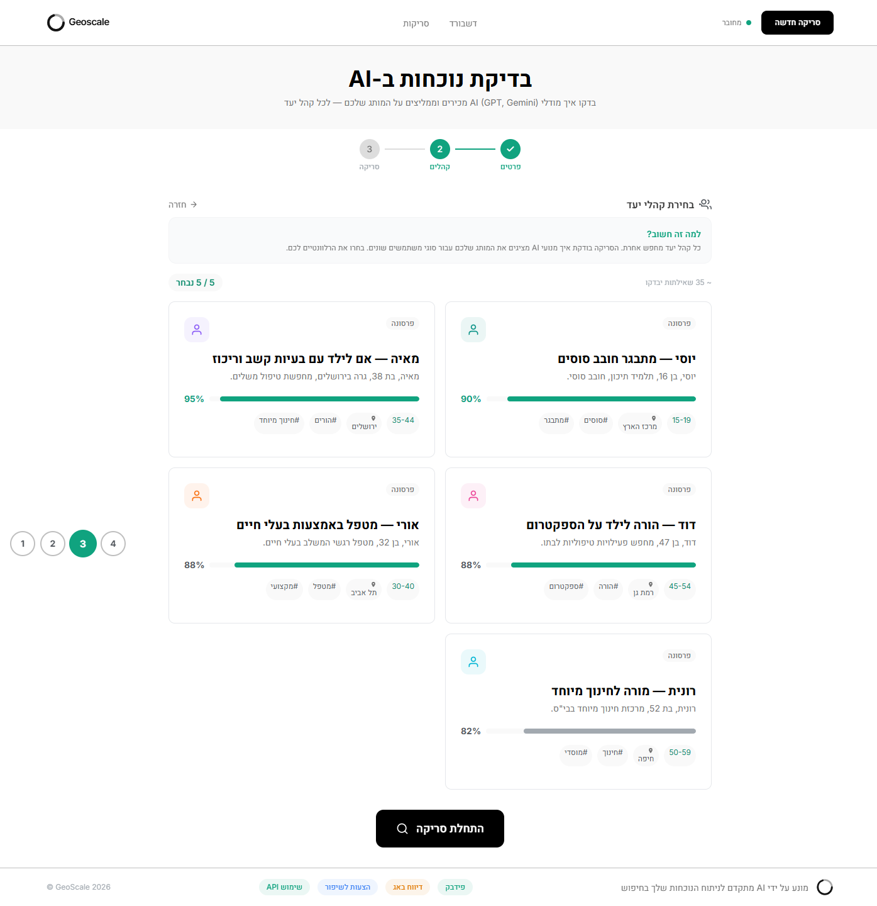

- **הדר** מלא (אותו דבר)
- **באנר כותרת** ירוק
- **Step indicator:** שלב 2 פעיל
- **כותרת:** "בחירת קהלי יעד" + הסבר "למה זה חשוב?"
- **סטטיסטיקה:** "~ 35 שאילתות יבדקו" | "5 / 5 נבחר"
- **כרטיסי פרסונות** (grid 2 עמודות):
  - כל כרטיס: אייקון פרסונה + שם + תיאור + אחוז רלוונטיות (progress bar) + תגיות
  - checkbox לבחירה (כולם נבחרים by default)
- 5 פרסונות: יוסי (90%), מאיה (95%), דוד (88%), אורי (88%), רונית (82%)
- כפתור **"התחלת סריקה"** (שחור, ממורכז)
- **פוטר**

### מסך 4: תהליך הסריקה (Process)

### צילום מסך:
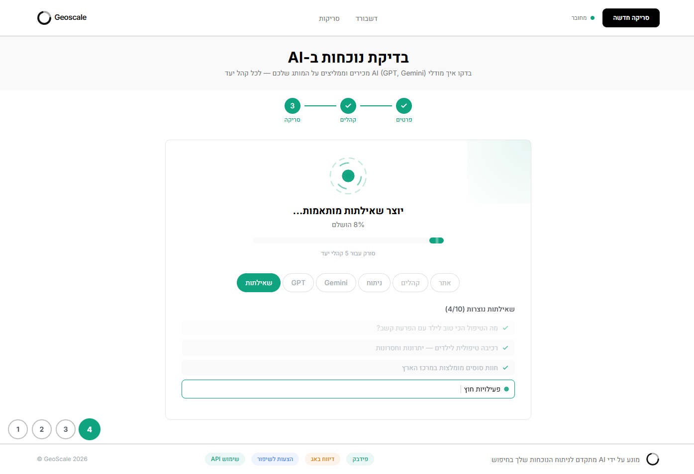

- **הדר** מלא
- **באנר כותרת** ירוק
- **Step indicator:** שלב 3 פעיל
- **כרטיס סריקה:**
  - אנימציית לוגו מסתובב
  - כותרת: "יוצר שאילתות מותאמות..."
  - אחוז הושלם + progress bar
  - "סורק עבור 5 קהלי יעד"
  - **Tabs:** שאילתות (פעיל) | GPT | Gemini | ניתוח | קהלים | אתר
  - רשימת שאילתות שנוצרות (V ירוק ליד כל שאילתה שהושלמה)
  - שאילתה נוכחית עם typing cursor מהבהב
- **פוטר**

**אנימציות מוגדרות ב-globals.css:**
- `spin-slow`, `spin-reverse` — גלגלי שיניים
- `wave` — עמודות אודיו
- `shimmer` — progress bar גלישה
- `typing-cursor` — קרסור מהבהב

---

## 7. דף 4: מוצרים ושירותים ( /products )

### צילום מסך:
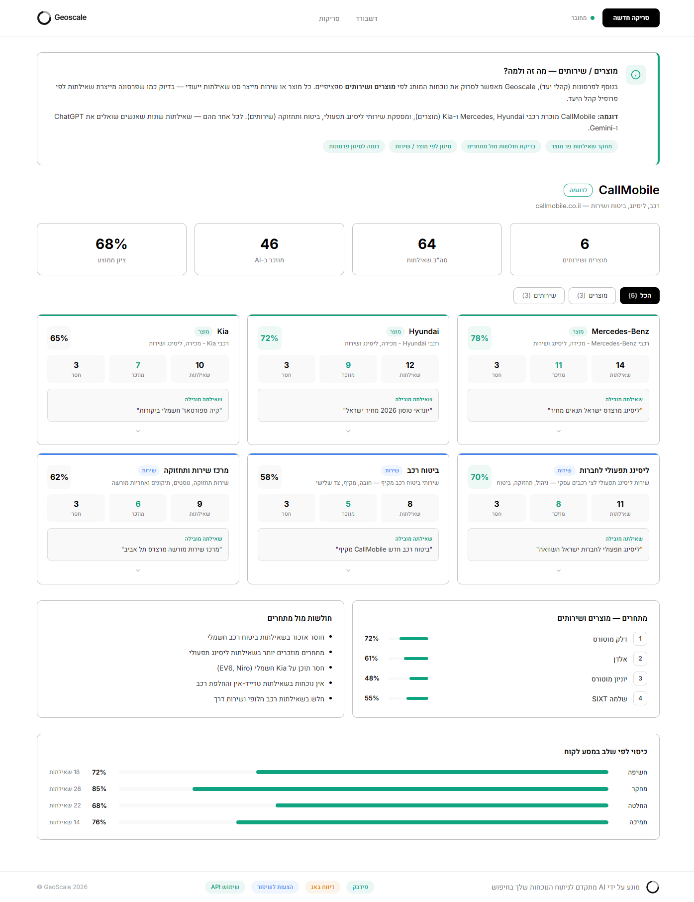

### 7.1 באנר הסבר
- כרטיס עם אייקון info circle
- כותרת: **"מוצרים / שירותים — מה זה ולמה?"**
- הסבר מפורט עם דוגמה (CallMobile)
- 4 badges: מחקר שאילתות | בדיקת חולשות | סינון לפי מוצר/שירות | דומה לסינון פרסונות

### 7.2 כותרת מותג
- **CallMobile** (badge "לדוגמה")
- תיאור: callmobile.co.il — רכב, ליסינג, ביטוח ושירות
- 4 מטריקות: מוצרים ושירותים (6) | סה"כ שאילתות (64) | מוזכר ב-AI (46) | ציון ממוצע (68%)

### 7.3 פילטר סוג
- 3 כפתורים: **הכל (6)** | מוצרים (3) | שירותים (3)
- כפתור פעיל: רקע שחור

### 7.4 כרטיסי מוצרים (grid 3 עמודות)
6 כרטיסים: Mercedes-Benz (78%) | Hyundai (72%) | Kia (65%) | ליסינג תפעולי (70%) | ביטוח רכב (58%) | מרכז שירות (62%)

כל כרטיס:
- שם + badge סוג (מוצר/שירות) + תיאור
- ציון אחוז (גדול)
- 3 מטריקות: שאילתות | מוזכר | חסר
- שאילתה מובילה (ציטוט)
- חץ להרחבה (טבלת שאילתות)

**בורדר עליון של כרטיסי מוצרים:** `3px solid #4285F4` (כחול)
**בורדר עליון של כרטיסי שירותים:** `3px solid #10A37F` (טורקיז)

### 7.5 מתחרים + חולשות — שני כרטיסים זה לצד זה
- **מתחרים:** דלק מוטורס (72%), אלדן (61%), יוניון מוטורס (48%), שלמה SIXT (55%)
- **חולשות מול מתחרים:** 5 bullet points

### 7.6 כיסוי לפי שלב במסע לקוח
- 4 שורות: חשיפה (72%) | מחקר (85%) | החלטה (68%) | תמיכה (76%)
- כל שורה: שם שלב + progress bar + אחוז + מספר שאילתות

---

## 8. שינויים שבוצעו לאחר פידבק

| שינוי | מה היה | מה עכשיו | סיבה |
|---|---|---|---|
| **הדר — CSS Grid** | Flexbox | Grid 3 עמודות `1fr auto 1fr` | יישור אחיד בכל הדפים |
| **מוצרים/שירותים** | בתפריט העליון | לשונייה 4 בדף /scan | זה פר-מותג, לא גלובלי |
| **שלבי מסע לקוח** | Progress bars אופקיים | כרטיסים קומפקטיים | פידבק אלכסיי — "תופס מלא מקום" |
| **השוואת AI** | Stacked bars (מוזכר/לא) | רק 2 כרטיסים נקיים | לא נראה טוב |
| **תשובה מלאה** | לא היה | כפתור "הצג תשובה מלאה" | בקשה להציג תשובות מלאות |
| **הדר+פוטר ב-new-scan** | לא היו | נוספו לכל 4 המסכים | עקביות |

---

## 9. מה צריך לעצב

### עדיפות גבוהה:
- [ ] דשבורד ראשי — כרטיסי מותגים + מטריקות + פעולות ממתינות
- [ ] דף סריקה — טאב סקירה (מטריקות, AI comparison, journey stages, signals)
- [ ] דף סריקה — טאב שאילתות (טבלה + expanded row + full answer)
- [ ] דף סריקה — טאב קהלים (כרטיסי פרסונות)
- [ ] הדר ופוטר (template אחיד)

### עדיפות בינונית:
- [ ] תהליך סריקה חדשה — 4 מסכים
- [ ] דף סריקה — טאב מוצרים/שירותים
- [ ] דף מוצרים מלא (/products)

### עדיפות נמוכה:
- [ ] אנימציות תהליך הסריקה (ניתן לפשט)
- [ ] States שונים (loading, empty, error)

---

## 10. קבצים בפרויקט

| קובץ | תיאור |
|---|---|
| `src/app/page.tsx` | דשבורד ראשי — כרטיסי מותגים |
| `src/app/scan/page.tsx` | תוצאות סריקה — 4 טאבים |
| `src/app/new-scan/page.tsx` | תהליך סריקה חדשה — 4 מסכים |
| `src/app/products/page.tsx` | דף מוצרים/שירותים מפורט |
| `src/app/globals.css` | צבעים, אנימציות, סגנונות גלובליים |

---

## 11. רשימת צילומי מסך

| קובץ | מה מוצג |
|---|---|
| `spec-screenshots/01-dashboard-header.png` | דשבורד — חלק עליון (הדר + מטריקות + כרטיסים) |
| `spec-screenshots/01-dashboard-full.png` | דשבורד — דף מלא כולל פעולות ממתינות ופעילות |
| `spec-screenshots/02-scan-overview-top.png` | סריקה — טאב סקירה חלק עליון |
| `spec-screenshots/02-scan-overview-full.png` | סריקה — טאב סקירה דף מלא |
| `spec-screenshots/03-scan-queries-tab.png` | סריקה — טאב שאילתות (טבלה + פילטרים) |
| `spec-screenshots/04-scan-query-expanded-snippet.png` | סריקה — שאילתה פתוחה עם snippets + כפתור "הצג תשובה מלאה" |
| `spec-screenshots/05-scan-query-full-answer.png` | סריקה — תשובה מלאה מ-ChatGPT (אחרי לחיצה) |
| `spec-screenshots/06-scan-audiences-tab.png` | סריקה — טאב קהלים (5 פרסונות) |
| `spec-screenshots/07-scan-products-tab.png` | סריקה — טאב מוצרים/שירותים |
| `spec-screenshots/08-newscan-screen1.png` | סריקה חדשה — מסך 1: הזנת פרטים |
| `spec-screenshots/09-newscan-screen2.png` | סריקה חדשה — מסך 2: אנימציית ניתוח |
| `spec-screenshots/10-newscan-screen3.png` | סריקה חדשה — מסך 3: בחירת פרסונות |
| `spec-screenshots/11-newscan-screen4.png` | סריקה חדשה — מסך 4: תהליך סריקה |
| `spec-screenshots/12-products-page-full.png` | דף מוצרים/שירותים מלא |

---

**נבנה על ידי:** Claude Code (Opus 4.6)
**עבור:** Inna (מעצבת) — כיוון עיצובי למוצר Geoscale
